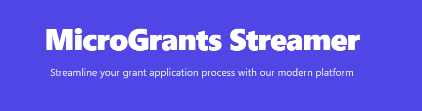

# MicroGrants Streamer ‎ ‎ ‎ ‎ ‎ ‎ ‎ ‎ ‎‎ ‎ ‎ ‎ ‎‎ ‎  ‎‎ ‎ ‎ ‎ ‎ ‎ ‎ ‎ ‎ ‎‎ ‎ ‎  ‎ ‎ ‎  ‎ ‎ ‎ ‎‎  ‎‎ ‎  ‎ ‎ ‎ ‎ ‎ ‎ ‎ ‎  [](https://app.netlify.com/sites/grantstreamer/deploys)

A modern web application for streamlined grant application management and disbursement tracking.



## Features

### Smart Application Review
Leverage AI-powered chat assistance for efficient grant application review.


### Digital Document Signing
Seamless integration with DocuSign for paperless grant agreements and Dropbox for secure document storage.


### Payment Tracking
Track disbursements and payment status with UPI integration.


## Technology Stack

- **Frontend**: React with TypeScript
- **UI Framework**: Tailwind CSS
- **AI Integration**: Google's Gemini 1.5 Pro
- **Document Signing**: DocuSign API
- **Document Storage**: Dropbox API
- **Payment**: UPI Integration

## Getting Started

### Prerequisites

- Node.js (v14 or higher)
- npm or yarn
- Google Cloud API Key (for Gemini)
- DocuSign Developer Account
- Dropbox App Credentials

### Installation

1. Clone the repository:
```bash
git clone https://github.com/yourusername/MicroGrants-Streamer.git
cd MicroGrants-Streamer
```

2. Install dependencies:
```bash
npm install
```

3. Set up environment variables:
```bash
cp .env.example .env
# Edit .env with your API keys and configuration
```

4. Start the development server:
```bash
npm run dev
```

## Usage

### For Applicants

1. Create a new grant application
2. Fill in required details
3. Submit for review
4. Sign approved documents
5. Track payment status

### For Administrators

1. Review applications with AI assistance
2. Approve or reject applications
3. Generate grant agreements
4. Save signed documents to Dropbox
5. Track disbursements

## Contributing

1. Fork the repository
2. Create your feature branch (`git checkout -b feature/AmazingFeature`)
3. Commit your changes (`git commit -m 'Add some AmazingFeature'`)
4. Push to the branch (`git push origin feature/AmazingFeature`)
5. Open a Pull Request

## License

This project is licensed under the MIT License - see the [LICENSE](LICENSE) file for details.

## Acknowledgments

- Google Gemini for AI capabilities
- DocuSign for document signing
- UPI for payment integration

---
